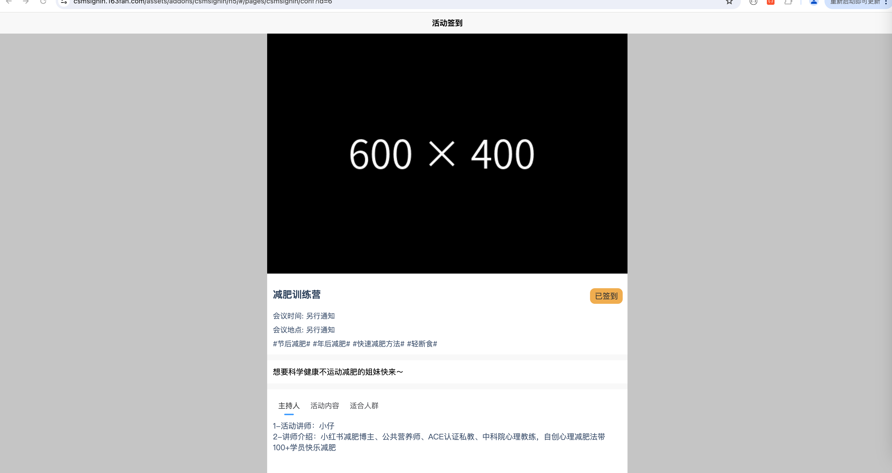

<b>会议/活动签到系统（开源版）</b> 
会议/活动签到系统（开源版）是由PHP、Uniapp（vue3）开发，支持H5、微信公众号和小程序，MIT协议。Activity Check-in System is developed with PHP and Uniapp (Vue 3), supporting H5, WeChat Mini Programs, under the MIT license.

## 在线演示

https://csmsignin.163fan.com/abc.php

用户名：csmsignin

密　码：csmsignincsmsignin

提　示：演示站数据无法进行修改 ，请下载源码安装体验全部功能

## 界面截图

## 功能清单
* 系统访问端口
    * 微信小程序
    * 微信公众号
    * 手机浏览器扫码访问
    * 电脑端浏览器访问
* 会议活动设置
    * 是否需要签到查看会议/活动信息
    * 是否限定会议参会人
    * 会议/活动签到时间范围设定
    * 会议/活动栏目信息设置

## 安装使用

* 安装 Nginx+Mysql+PHP 运行环境
* 下载源码，网站目录设置指向到 %本项目%/public 目录,以宝塔为例,设置如下

* 域名访问后，进入到安装程序

## 重新安装
* 运行脚本
php xp_product_console_revertinstall.php

## 部署环境
* Mysql 5+
* Nginx
* PHP 7

## 技术架构
* PHP 7.x , Mysql 5.x 和 Nginx/Apache ，可以用宝塔、LAMP和WAMP等集成环境部署
* Thinkphp 5.x，Fastadmin 1.x
* Bootstrap 3.x , JQuery 2.1.x
* Uniapp，Vue3，UvUI

## 问题反馈 & 新需求新想法

目前产品正在需求整理中，如您有新想法随时联系我

联系方式: chenshiming0802@163.com

Github: https://github.com/chenshiming0802/thinkphp_fastadmin_signin

Gitee: https://gitee.com/chenshiming0802/thinkphp_fastadmin_signin

## 特别鸣谢

感谢以下的项目,排名不分先后

ThinkPHP：http://www.thinkphp.cn

FastAdmin：https://www.fastadmin.net/

AdminLTE：https://adminlte.io

Bootstrap：http://getbootstrap.com

jQuery：http://jquery.com

Bootstrap-table：https://github.com/wenzhixin/bootstrap-table

Nice-validator: https://validator.niceue.com

SelectPage: https://github.com/TerryZ/SelectPage

Layer: https://layuion.com/layer/

DropzoneJS: https://www.dropzonejs.com

SDNode: https://gitee.com/sdnode/xstack

## 版权信息

本遵循MIT开源协议发布。

本项目包含的第三方源码和二进制文件之版权信息另行标注。

版权所有Copyright © 2017-2024 by chenshiming0802 (https://csmsignin.163fan.com)

All rights reserved。
